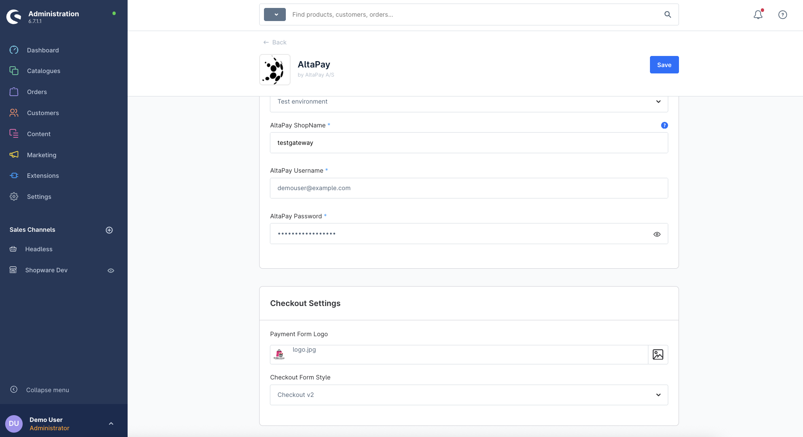
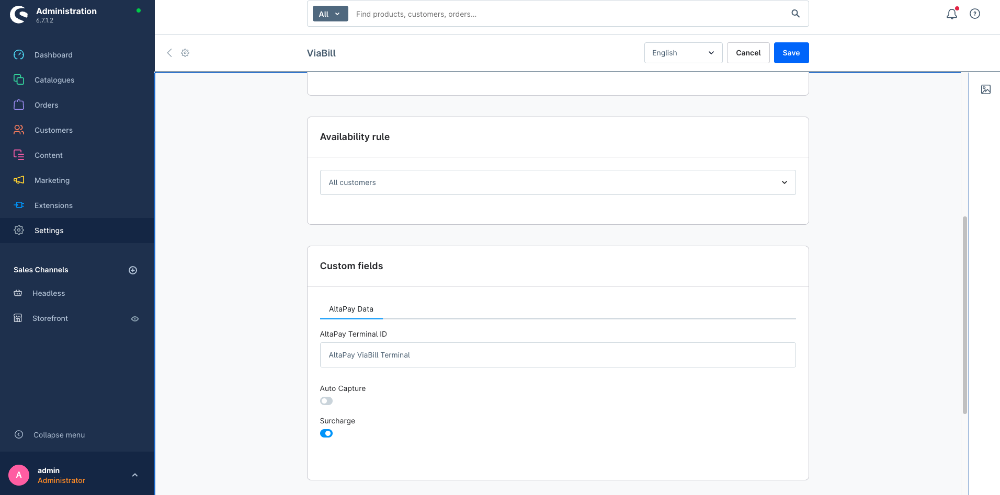

# AltaPay Shopware Plugin

AltaPay, headquartered in Denmark, is an internationally focused fintech company within payments with the mission to make payments less complicated. We help our merchants grow and expand their business across payment channels by offering a fully integrated seamless omni-channel experience for online, mobile and instore payments, creating transparency and reducing the need for manual tasks with one centralized payment platform.

AltaPay’s platform automizes, simplifies, and protects the transaction flow for shop owners and global retail and e-commerce companies, supporting and integrating smoothly into the major ERP systems. AltaPay performs as a Payment Service Provider operating under The Payment Card Industry Data Security Standard (PCI DSS).

## Installation guide

Installing this plugin will enable the web shop to handle transactions through AltaPay's gateway.

**Table of Contents**

[Prerequisites](#prerequisites)

[Installation](#installation)

[Configuration](#configuration)

[Supported versions](#supported-versions)

[Troubleshooting](#troubleshooting)

## Prerequisites

Before configuring the plugin, you need the below information. These can
be provided by AltaPay.

1.  AltaPay credentials:
    -   Username
    -   Password

2.  AltaPay gateway information:
    -   Terminal
    -   Shop Name

> **Note:** If the API user credentials have not yet been created, refer to the [Creating a New API User](#creating-a-new-api-user) section for step-by-step instructions.

## Installation

1. Download the latest release (**altapay-master.zip**) file from the [Releases](https://github.com/AltaPay/plugin-shopware/releases) tab

2. Go to **Admin** > **Extensions** > **My extensions** and click on **Upload extension** from the top-right corner and upload the extension zip file.

   

3. After the extension is uploaded successfully, click on **Install** button for installation.

   

## Configuration

1. Go to **Extensions** > **My extensions** and find the **AltaPay** extension. This can be done by searching for **AltaPay**. Click on **Configure** for the extension.

   

2. Choose required environment and add respective Gateway ShopName, Username & Password.

   

3. Enable **Keep order in open state** setting if you don't want to change the order state to `Processing` when customer has completed the payment flow.

   

4. To add the payment methods, go to **Settings** > **Shop** > **Payment methods**. This will fetch the list of payment methods for the checkout page.

   

5. To set up a new payment method click on **Add payment method** button from the top-right corner.

   

6. When setting up a payment method you can select the **Name** and **Logo** that is going to be shown on the checkout page.
 
7. The **Technical Name** is the name of the terminal from AltaPay. 

8. In the optional field **Description**, you can add custom message for the customers. e.g. guidelines from Danish Forbrugerombudsmanden.

9. Enable the option **Allow payment change after checkout** to allow users to retry payment using the same or different payment method in case it fails, or they cancel it.

   

10. Click the **Save** button.

11. Once saved, a new section **Custom fields** will appear with **Auto Capture** option and **AltaPay Terminal ID** field in which you must add the name of the terminal from AltaPay.  

    

12. Click the **Save** button again.

13. Now click on your desired shop from the **Sales Channels** menu on the left.
 
14. In the **General** tab, scroll down to the **Payment and shipping** section & search by name for the payment method you just created.

    

15. Choose the payment method and click Save button in the top-right corner.

    

16. Once the payment methods are configured, you will be ready to process transactions through AltaPay.

    

## Creating a New API User

To create a new API user in your AltaPay account, please follow these steps:

- Log in to your AltaPay account.
- From the left menu, navigate to **Settings** > **API Keys**.

    
    
- Click on the **Create New API Key** button from top right corner.
- Fill in the required fields:
    - **Your current password**  
    - **Username**  
    - **Password**  
    - **Assign Shops**
    
    
- After entering the details, click **Create**.

The new credentials can now be used as the API Username and API Password in the Gateway Account Configuration section.

## Supported versions
- Shopware 6.5.x

The latest tested version is `6.5.8.13`

## Troubleshooting

**PHP Warning: Input variables exceeded 1000. To increase the limit change max_input_vars in php.ini.**

- Open your php.ini file
- Edit the max_input_vars variable. This specifies the maximum number of variables that can be sent in a request. The default is 1000. Increase it to, say, 3000.
- Restart your web server.

**Parameters: description/unitPrice/quantity are required for each orderline, but was not set for line: xxxx**
> The same problem as above. The request is being truncated because the number of variables are exceeding the max_input_vars limit.

## Providing error logs to support team

**You can find the Shopware logs in `var/logs/` directory in your Shopware installation.**

**Web server error logs**

**For Apache server** You can find it on `/var/log/apache2/error.log`

**For Nginx** it would be `/var/log/nginx/error.log`

**_Note: Your path may vary from the mentioned above._**